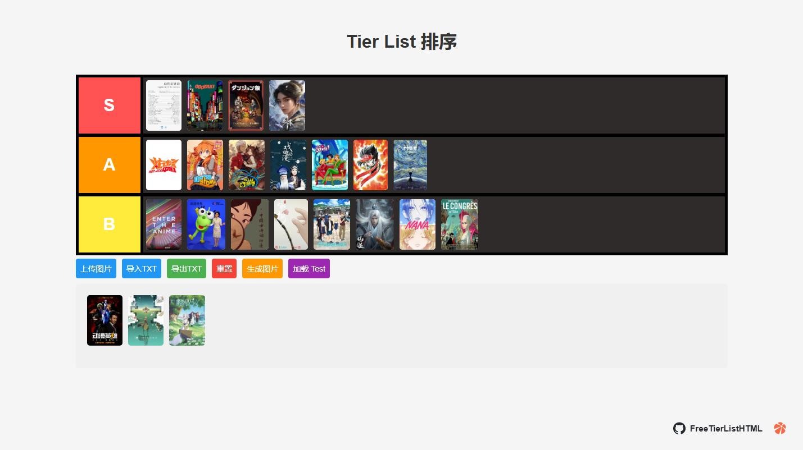

# FreeTierListHTML

一个纯前端的 Tier List 排序页面，支持拖拽图片到不同等级（S/A/B…），可导入/导出 TXT，支持从 URL 远程加载，支持生成当前布局的截图图片。

## 简单说明

1. 如果插入的图片是本地的，下载下来会转化为 base64，如果是链接则不进行转换
2. 如果你是想分享你的创造，可以使用?txt=https://your.cdn.com/tiers/sample.txt 注意：不支持跨域的txt不行。
3. 单击Tier List 排序，修改名称

## 图片



## 功能概览
- 自定义层级行：支持新增、上移、下移、清空、删除、修改颜色和标签名
- 图片管理：支持本地图片上传（自动等比缩放到高 200px）、拖拽排序、删除
- 文本导入/导出：将图片（URL 或 base64）按层级记录在 TXT 中
- URL 远程加载：通过 `?txt=` 参数从远程地址加载 TXT 并渲染
- 生成截图：使用 html2canvas 将当前 Tier 列表布局导出为 PNG
- 加载默认测试：点击“加载 Test”从 `./txt/test.txt` 载入示例数据
- 底部控制面板自动隐藏/显示，增强操作体验

## 快速开始
1. 直接用浏览器打开 `index.html`（双击或拖到浏览器）。
2. 底部出现控制区：
   - 上传图片：选择本地图片，自动压缩后加入图片池
   - 导入TXT：选择符合格式的 TXT 文件，自动生成层级与图片
   - 导出TXT：将当前布局导出为 TXT（包含各层级及图片池的图片）
   - 重置：将所有图片移回图片池，确保 S/A/B 默认行存在，删除空的自定义行
   - 生成图片：将当前 Tier 布局截图并下载
   - 加载 Test：从 `./txt/test.txt` 加载示例数据

## TXT 格式说明
- 以 `#` 开头的行为层级标签名（例如 `#S`、`#A`、`#B`、`#角色` 等）
- 标签行之后的每一行是图片地址（支持 http/https URL 或 base64 data URL）
- 特殊标签 `#img` 表示“图片池”的图片列表

示例：
```
#S
https://example.com/image1.png
data:image/png;base64,iVBORw0KGgo...

#A
https://example.com/image2.jpg

#img
https://example.com/extra.png
```

注意：
- 标签行的文本将作为左侧标签显示，支持中文
- 图片会被渲染为高度 200px、宽度自适应的缩略图

## 通过 URL 加载远程 TXT
在地址栏中使用 `txt` 参数：
```
index.html?txt=https://your.cdn.com/tiers/sample.txt
```
- 页面会尝试抓取远程 TXT 并渲染
- 标题会自动设置为该 TXT 文件名（去除扩展名）
- 需要远程资源允许跨域访问（CORS）

## 操作说明
- 行操作（鼠标悬停于左侧彩色标签处出现按钮）：
  - ↑ 上移行
  - ↓ 下移行
  - + 在当前行下方新增一行
  - □ 清空当前行（图片移动到图片池）
  - × 删除当前行（图片移动到图片池）
  - ■ 修改当前行颜色（弹出色板）
- 编辑标签名：点击标签文本即可编辑，回车或失焦保存
- 拖拽：从图片池或其他层级将图片拖到目标位置，支持在同层内排序
- 删除图片：图片右上角 × 按钮

## 截图导出
- 点击“生成图片”，会临时隐藏控制区域与图片池，仅输出 Tier 列表区域
- 生成的 PNG 文件名为当前标题文本
- 使用 html2canvas（CDN）：`https://html2canvas.hertzen.com/dist/html2canvas.min.js`

## 加载默认测试
- 点击“加载 Test”将从 `./txt/test.txt` 加载
- 需要确保该文件在 `txt` 目录下，且与 TXT 格式一致

## 重置逻辑
- 将所有层级中的图片移回图片池
- 保证 S/A/B 三个默认行存在
- 删除无图片的非默认行

## 兼容性与依赖
- 现代浏览器（Chrome/Edge/Firefox）均可使用
- 截图功能依赖 html2canvas（通过 CDN 自动加载）
- 远程加载/跨域由目标服务器的 CORS 决定

## 常见问题
- 远程 TXT 加载失败：检查 URL 是否可公开访问、是否允许 CORS
- 图片不显示或跨域问题：部分站点图片可能禁止跨域或防盗链，建议使用可公开访问的图片或转为 base64
- 标签颜色不满意：点击标签处的颜色按钮（■）弹出色板更换